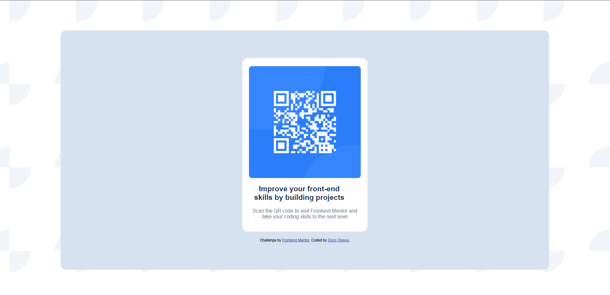

# Frontend Mentor - QR Code Component Solution

This is my solution to the [QR code component challenge on Frontend Mentor](https://www.frontendmentor.io/challenges/qr-code-component-iux_sIO_H).  
I built this as part of my frontend development learning journey and to practice working with real-world projects.

## 📸 Screenshot

## Live Site

👉 [View Live Project](https://doris-okewu.github.io/qr-code-component/)

## 🛠 Built With

- Semantic HTML5 markup
- CSS custom properties
- Flexbox
- Google Fonts
- Git & GitHub

## What I Learned

- How to set up Git and GitHub properly from scratch
- How to link fonts from Google Fonts and apply font weights
- Flexbox centering using justify-content and align-items
- Creating radial background gradients
- Working with spacing, padding, and box sizing to properly align elements
- Making sure content is accessible and responsive
- Pushing a project to GitHub and deploying with GitHub Pages

## Challenges Faced

- Understanding how to center elements vertically and horizontally
- Managing layout inside multiple containers (card inside background)
- Adjusting spacing to match the design
- GitHub setup and authentication for pushing code
- Making the design responsive and visually accurate

## Continued Learning

This was a great beginner challenge to get comfortable with:

- Folder structure
- Terminal commands
- VS Code workflow
- Using version control
- Styling components from a design guide

I’m continuing to work through Frontend Mentor challenges as part of my _#100DaysOfCode_ challenge.

## 🙋‍♀ Author

- Name: **Doris Okewu**
- Learning publicly through #100DaysOfCode
- [Frontend Mentor Profile](https://www.frontendmentor.io/profile/Doris-Okewu)
- [LinkedIn](https://www.linkedin.com/in/doris-okewu)
- [Twitter/X](https://x.com/Doristechne)

---

Thank you Frontend Mentor for the amazing project ideas!
